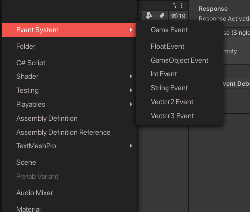
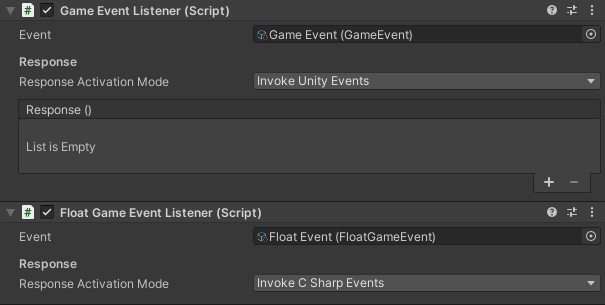

# Scriptable Object Event System

This package delivers a scriptable object based event system. It is based on [this Unity article](https://unity.com/how-to/architect-game-code-scriptable-objects) which details different tips on how to architect games with Scriptable Objects, including with an [event system](https://unity.com/how-to/architect-game-code-scriptable-objects#architect-events).

## Usage

The package consists of two parts: *GameEvent* Scriptable Objects and *Listener* MonoBehaviours (scripts).

### Game Events

*Game Events* are Scriptable Objects to be created as Assets in the project hierarchy.



Designers can create any number of GameEvents in the project to represent important messages that can be sent. There are several types of GameEvents, so different parameters can be supported. As such, the basic `GameEvent` handles events which requires no parameters to be sent. Other events are considered as *parametrized* and handle events with one parameter whose type is designated by the event's name (`float` for a `FloatGameEvent`, `Vector2` for a `Vector2GameEvent`, etc…).

### Game Event Listeners

A *Game Event Listener* waits for a specific *Game Event* to be raised and responds by invoking a *UnityEvent* or *C# Event*, depending on its configuration. As such, they can handle a specific event call and trigger a specified callback method themselves.



Adding response method to a listener through code is possible in different ways depending on if you're using Unity Events or C# Events:

* If you're using Unity Events (*Invoke Unity Events*), you need to use:
```csharp
_listener.UnityEventResponseAction += MyMethod;
```
* If you're using C# Events (*Invoke CSharp Events*), you need to use:
```csharp
_listener.Response += MyMethod;
```

## Installation

### Git

If you have access to this package through a git repository, you can add the package to the package manager (+ -> Add package from Git URL…). You can also add it directly to your project's `manifest.json` dependencies:

```json
    "fr.sticmac.eventsystem": "<git url>"
```

### Local download

If you got this package through direct downloading, you can directly add it through the package manager as local package (+ -> Add package from disk…). 

Adding the package folder directly inside the Assets folder is also possible. You may need to import the different Assembly Definitions inside your project. You may find more information in the [corresponding article in the Assembly Definitions](https://docs.unity3d.com/2019.4/Documentation/Manual/ScriptCompilationAssemblyDefinitionFiles.html).
